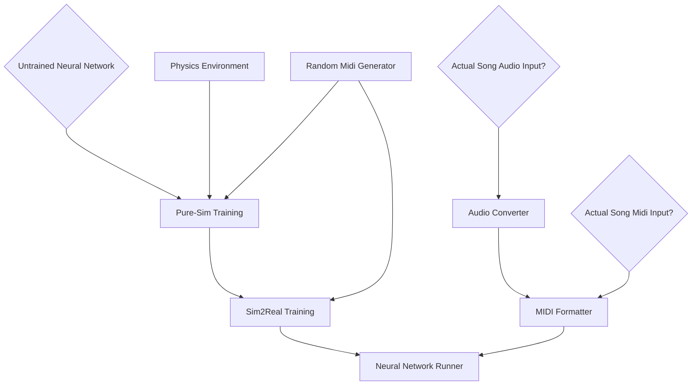

# September 17, 2026

Quick briefing on genesis, basic system design plan

RL Training 
- Group together agrees training curriculum maybe looks like
  1. single finger movements (stationary hand)
  2. chords (stationary hand)
  3. finger movements that require stretching (stationary hand)
  4. unlocked arm movement + jumps between random notes
  5. full complex songs
- Clay asks: How do we feed MIDI songs to a neural network?
  - Tristan suggests JSON (presumably into an LLM?)
  - Array of tuples is faster?
    - a Convolutional Neural Network can read those already for images! This is a fairly solved problem
